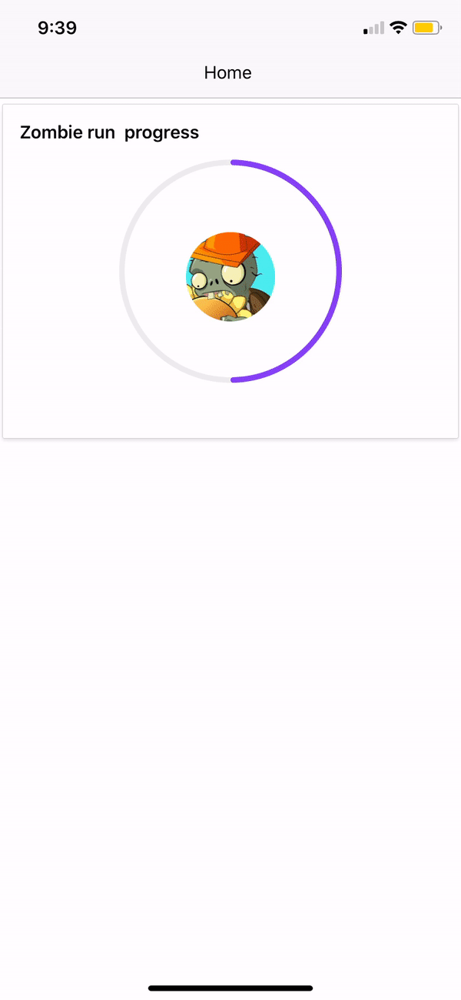
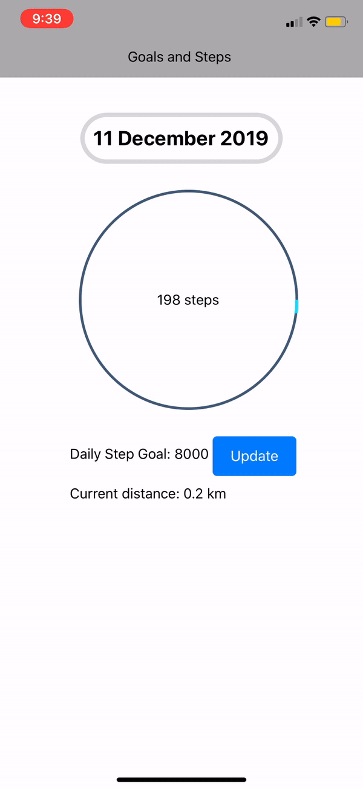

# StepUp App

This is an health engagement app rewarding users for engaging in physical activity, mainly walking, jogging or running.

## React Native
Steps on how to start the React Native project: https://facebook.github.io/react-native/docs/getting-started

Assuming you have Node 10 or higher, you can use npm install the Expo CLI command line utility: 

```
npm install -g expo cli
```

Then enter the folder "StepUp-ReactNative", and start:

```
cd StepUp-ReactNative
npm start #you can also use: expo start
```

This will start the development server for you. 


### Running the React Native application

Install the Expo client app on your iOS or Android phone and connect to the same wireless network as your computer. On Android, use the Expo app to scan the QR code from your terminal to open your project. On iOS, follow on-screen instructions to get a link.

This development console should show up on your browser within a localhost link when you run "npm start" or "expo start".


### Project Database and Middle Layer

The middle layer and backend for this project was done through Firebase. We have hosted our middle layer api(Built with ExpressJs and NodeJs on a firebase link, so you need not worry about running that part. If you do want to change the code, it is provided in this repo, and a deployment through the Firebase account is required to change the ExpressJs + NodeJs middle layer code. 

For the database, it is stored in Firebase and it is done through the middle layer. 


### Using the API

Here are some endpoints made for a joining challenges, viewing and available challenges. The "/steps/log" endpoint automatically updates the progress of any joined challenges, and "/steps/distance" shows the total distance of a user.

(Errors)
404 Not Found Response:
```
"Cannot {METHOD} {path}"  // 'Cannot GET /does/not/exist'
```

500 Internal Error Response:
```
{
    "msg": (string),
    "err": (object)
}
```

(PUT) https://step-up-app.firebaseapp.com/challenges/join/{id}?email={email_address}
Response:
```
{
    "msg": "{email_address} joined {id}",
    "data": {
        "joinedAt": (timestamp),
        "distance": (number),  // the distance of the challenge
        "progress": 0
    }
}
```
(GET) https://step-up-app.firebaseapp.com/challenges/available
Response:
```
[

    {
        "id": (string),
        "title": (string),
        "active": true,  // if false then it's not available
        "description": (string),
        "distance": (number),
        "reward": (string)
    },

    // ...
]
```

(GET) https://step-up-app.firebaseapp.com/challenges/get/{id}
same as
(GET) https://step-up-app.firebaseapp.com/challenges/{id}
Response:
```
{
    "title": (string),
    "active": (boolean),
    "description": (string),
    "distance": (number),
    "reward": (string)
}
```

(POST) https://step-up-app.firebaseapp.com/steps/log?email={email_address}
Send:
```{
    "steps": (number),  // >0
    "timestamp": (timestamp)  // Optional. Use 'Date.now()'
}
```

Response:
```
{
    "added": {
        "steps": (number),
        "timestamp": (timestamp)
    },
    "updatedChallenges": [
        {
            "id": (string),
            "distance": (number),
            "progress": (number),  // updated
            "achieved": true  // field only appears if it's achieved
        },

        // ...
    ]
}
```

(GET) https://step-up-app.firebaseapp.com/steps/distance?email={email_address}
Response:
```
{
    "total": {
        "steps": (number),
        "distance": (number)
    },
    "steps": [
        {
            "id": (string),
            "steps": (number),
            "distance": (number)
        },

        // ...
    ]
}
```


### Working Demo of our App


Home Page.



Step Tracker, and changing your daily step goal.


Challenges, and you can join and leave.


Viewing your rewards, and sharing it to social media.
